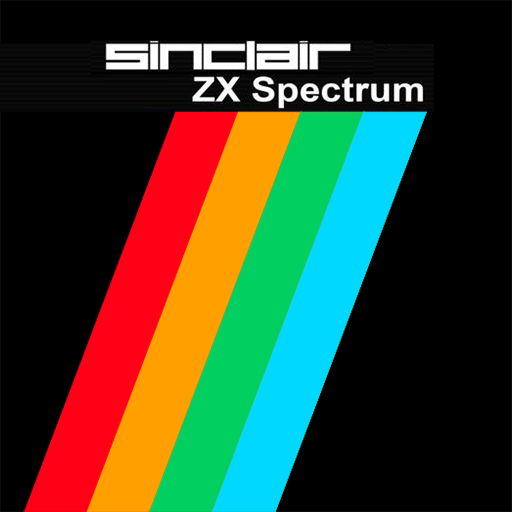
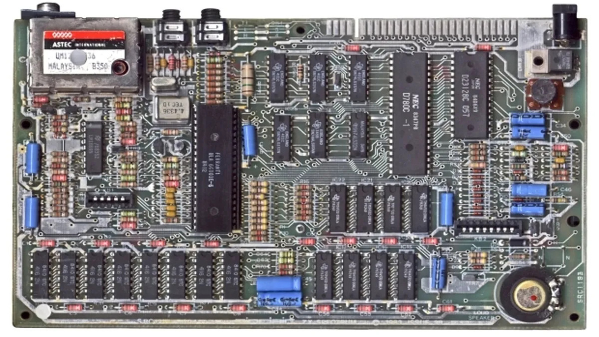

# Sinclair - ZX Spectrum (Fuse)

### Description

Fuse (the Free Unix Spectrum Emulator) was originally a ZX Spectrum emulator for Unix. It has since been ported to Mac OS X, Windows, the Wii, AmigaOS and MorphOS.

### License

GPLv3

### Icon

### Fanart

### Screenshots

Help make me screenshots!
